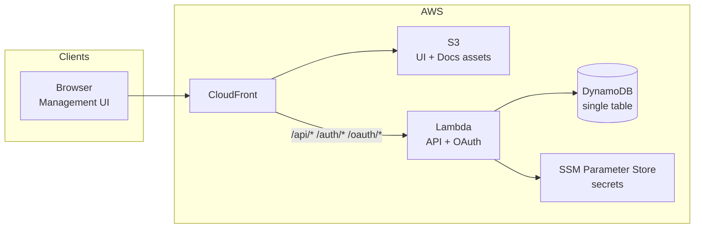
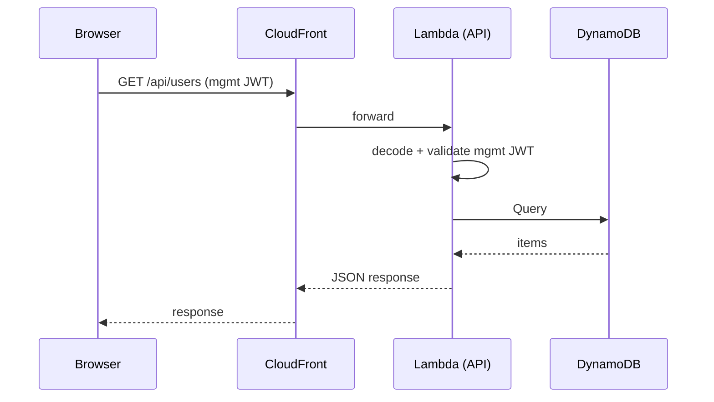
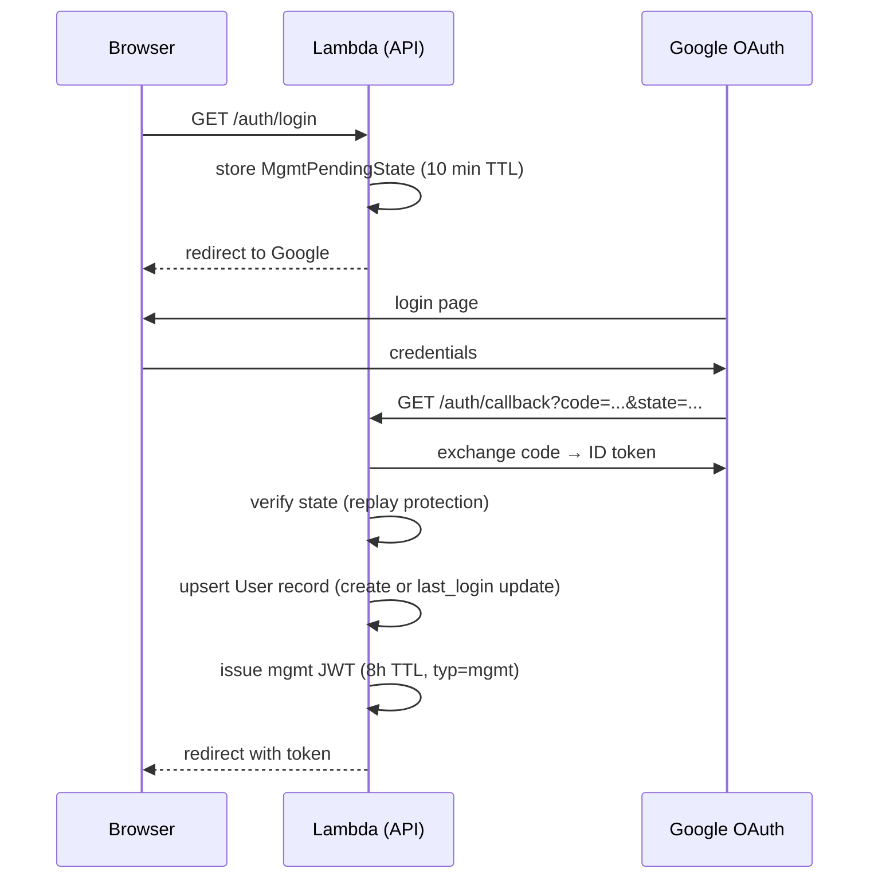
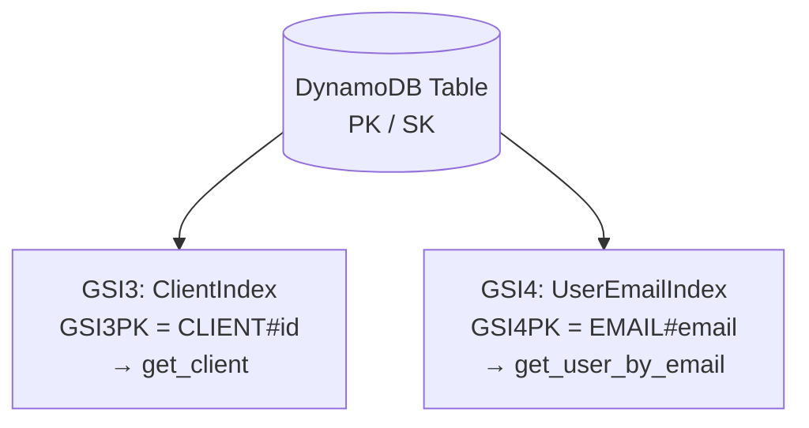
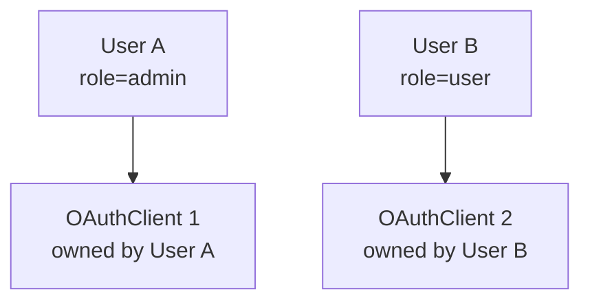

# AgentCore Starter — System Architecture

Internal/contributor reference. Not part of the customer-facing docs site.

---

## Table of contents

1. [High-level overview](#high-level-overview)
2. [AWS infrastructure](#aws-infrastructure)
3. [Request flows](#request-flows)
4. [OAuth 2.1 / PKCE flow](#oauth-21--pkce-flow)
5. [DynamoDB single-table design](#dynamodb-single-table-design)
6. [Multi-tenancy model](#multi-tenancy-model)
7. [Security layers](#security-layers)

---

## High-level overview

AgentCore Starter exposes one Lambda-backed surface behind a single CloudFront distribution:

| Surface | Path prefix | Lambda entrypoint |
| --- | --- | --- |
| Management API (FastAPI) + OAuth | `/api/*`, `/auth/*`, `/oauth/*`, `/.well-known/*` | AWSLWA → uvicorn `starter.api.main:app` (see `run.sh`) |
| Management UI (React SPA) | everything else | S3 → CloudFront (static) |
| Docs site (VitePress) | `/docs/*` | S3 → CloudFront (static) |

---

## AWS infrastructure

### CloudFront

- Single distribution fronts both the Lambda and the S3 UI/docs bucket
- **Cache behaviours** (evaluated in order):
  - `/api/*`, `/auth/*`, `/oauth/*`, `/.well-known/*`, `/health` → `CachingDisabled` (no-cache), forwarded to API Lambda Function URL
  - `default` → `CachingOptimized` (UI/docs assets from S3)

### Lambda function

- Python 3.12, 512 MB, 30 s timeout
- Function URL with `auth=NONE` (CloudFront handles routing)
- X-Ray active tracing
- Environment variables injected by CDK: table name, SSM param paths, issuer URL, app version

### DynamoDB

- Single table, `PAY_PER_REQUEST` billing
- 4 Global Secondary Indexes (see [DynamoDB design](#dynamodb-single-table-design))
- TTL on `ttl` attribute (auth codes, tokens, pending state)
- Point-in-time recovery enabled in prod

### SSM, CloudWatch

- Secrets in SSM Parameter Store: JWT secret, Google OAuth credentials
- CloudWatch dashboard + alarms (error rate, P99 latency, DynamoDB throttles, CloudFront 5xx)

---

## Request flows

### Management UI request

---

## OAuth 2.1 / PKCE flow

AgentCore Starter implements a full OAuth 2.1 authorization server. The management UI uses a Google-backed login flow.

### Management UI login (Google → mgmt JWT)

---

## DynamoDB single-table design

All entities share one table. The entity type is encoded in the PK prefix.

### Access patterns and key schema

| Entity | PK | SK | GSI | TTL |
| --- | --- | --- | --- | --- |
| OAuth Client | `CLIENT#{client_id}` | `META` | GSI3: `CLIENT#{client_id}` | — |
| Token | `TOKEN#{jti}` | `META` | — | ✓ (1h access / 30d refresh) |
| Authorization Code | `AUTHCODE#{code}` | `META` | — | ✓ (5 min) |
| Pending Auth (PKCE) | `PENDING#{state}` | `META` | — | ✓ (10 min) |
| User | `USER#{user_id}` | `META` | GSI4: `EMAIL#{email}` | — |
| Mgmt Pending State | `MGMT_STATE#{state}` | `META` | — | ✓ (10 min) |
| Activity Log | `LOG#{date}#{hour}` | `{timestamp}#{event_id}` | — | — |

Activity log is hour-sharded (24 partitions per day) to avoid hot partitions on high-write workloads.

### Global Secondary Indexes

---

## Multi-tenancy model

### Access rules

| Actor | Can see |
| --- | --- |
| Mgmt UI (role=user) | Only their own data |
| Mgmt UI (role=admin) | All data across all users |

---

## Security layers

| Layer | Mechanism |
| --- | --- |
| Management UI authentication | Google OAuth → mgmt JWT (`typ=mgmt`, 8h TTL) |
| PKCE | Required on all authorization code flows; SHA-256 challenge/verifier |
| Least-privilege IAM | Lambda role scoped to specific DynamoDB table and SSM params |
| Secrets management | JWT secret + Google credentials in SSM Parameter Store; never in env vars for prod |
| Token lifecycle | Access: 1h, Refresh: 30d, Auth Code: 5m — all with DDB revocation support |
